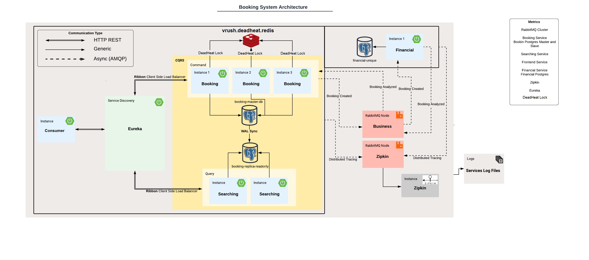

# Utter-Microservices-Territory

"Microservices", Yet another buzzword nowadays. What problems does it solve?

There are tons of definitions you will find, but my preferred one is by Martin Fowler,

> Microservice architectural style is an approach to developing a single application as a suite of small services, each running in its own process and communicating with lightweight mechanisms, often an HTTP resource API. These services are built around business capabilities and independently deployable by fully automated deployment machinery. There is a bare minimum of centralized management of these services, which may be written in different programming languages and use different data storage technologies.

## What you'll get from here?

This microservices based project demonstrates how multiple services run independently leveraging with the desire designing patterns to enable scale, performance and resilience.

- Highly maintainable and testable - enables rapid and frequent development and deployment\
    [By plaing fair, I'm not a devotee of TDD :) ]
- Loosely coupled with other services - enables a team to work independently the majority of time on their service(s) without being impacted by changes to other services and without affecting other services
- Independently deployable - enables a team to deploy their service without having to coordinate with other teams
- Capable of being developed by a small team - essential for high productivity by avoiding the high communication

## System Architecture

## Technology Stack Used
- **RabbitMQ** as a Message Broker
- **Feign** to create REST Clients
- **Ribbon** to Client Side Load Balance
- **Eureka** to a Service Discovery
- **Sleuth** and **Zipkin** to a Distributed Tracing
- **Hystrix** to a Fault Tolerance
- **Thymeleaf** as a template engine
- **Postgres** as Database
- **Splunk** as Log Analysis Platform
- **Swagger** to create an API documentation
- **DeadHeat Lock** as a locking mechanism to avoid concurrency issues

## Starting services locally without Docker

Every microservice is a Spring Boot application and can be started locally using IDE (Lombok plugin has to be set up) or ../mvnw spring-boot:run command. 

Note: **RabbitMQ**. Download and install [RabbitMQ](https://www.rabbitmq.com/download.html). I used it as Event bus. When you have installed it, you need to run the RabbitMQ server (as a service or as a process, whatever you prefer).

I used a thymeleaf template from [Frontend Template - Delux by Colorlib](https://colorlib.com/wp/template/deluxe/) as an interface.

## Ports

|     Application       |     Port          |
| ------------- | ------------- |
| Booking Microservice | 8100 |
| Searching Microservice | 8200 |
| Financial Microservice | 8300 |
| Consumer Microservice | 8400 |
| RabbitMQ | 5672, 5673 |
| RabbitMQ Admin UI | 15672, 15673 |
| Booking Postgres Master | 5432 |
| Booking Postgres ReadOnly Replica| 5433 |
| Financial Postgres | 5434 |
| Splunk | 8000 |
| Netflix Eureka | 8761 |
| Zipkin | 9411 |
| DeadHeat Lock | 6379 |

##DeadHeat Lock
Locking mechanism here used as a usecase in Booking service on save booking to ensure that user not allow to book a room with same RoomId(which can be called from different VMs simultaneously). 

# That's all. Leave a star if it helped you!

